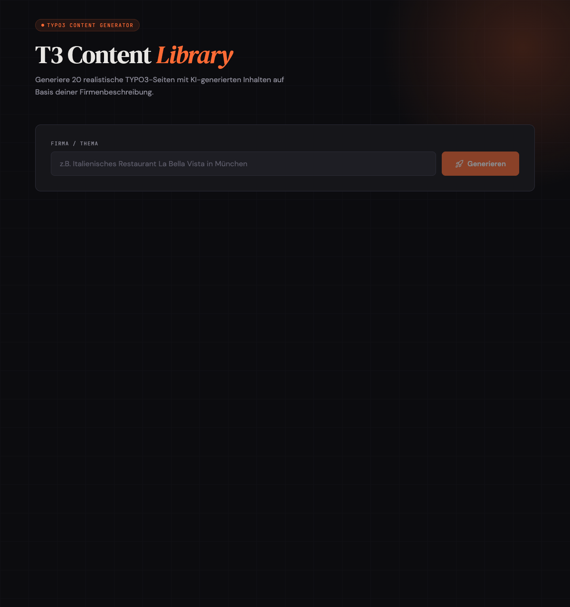
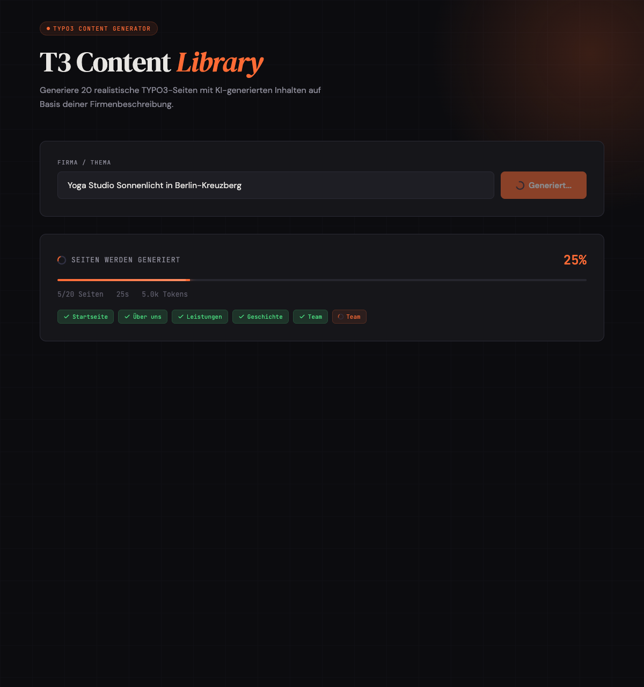
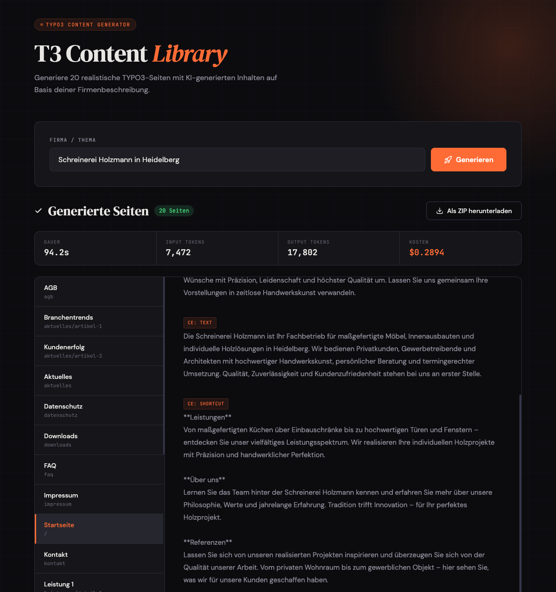

# T3 Content Library

Python CLI + Web UI that generates 20 realistic TYPO3 example pages with AI-generated German content using the Claude API. Each page is output as Markdown with YAML frontmatter and TYPO3 content element annotations.



## What it does

Given a company description (e.g. "Italienisches Restaurant La Bella Vista in München"), the tool generates a complete set of 20 pages typical for a German business website:

| Pages | Description |
|-------|-------------|
| Startseite, Über uns, Team, Geschichte | Company presentation |
| Leistungen + 3 Detail pages | Services / Products |
| Referenzen + Detail | Portfolio / Case studies |
| Aktuelles + 2 Articles | News / Blog |
| FAQ, Kontakt | Support |
| Impressum, Datenschutz, AGB | Legal (German) |
| Downloads, Sitemap | Utilities |

Each generated Markdown file contains:
- YAML frontmatter with title, slug, parent, layout, nav position, SEO fields
- Content elements annotated with `<!-- CE: type -->` comments matching TYPO3 CE types (header, textmedia, text, quote, accordion, etc.)

## Web UI

The project includes a React frontend with real-time progress tracking, token usage display and page preview.

**Progress tracking** with page chips, live token counter and elapsed time:



**Results view** with stats bar (duration, tokens, cost) and content preview:



## Requirements

- Python 3.11+
- Node.js 18+ (for Web UI)
- [Anthropic API key](https://console.anthropic.com/)
- Docker & Docker Compose (for production deployment)

## Installation

### CLI

```bash
git clone https://github.com/dkd-dobberkau/t3-content-library.git
cd t3-content-library
uv venv .venv && source .venv/bin/activate
uv pip install -r requirements.txt
```

### Web UI (Development)

```bash
# Backend
cd backend
uv venv .venv && source .venv/bin/activate
uv pip install -r requirements.txt -r ../requirements.txt

# Frontend
cd ../frontend-vite
npm install
```

### Docker (Production)

```bash
cp .env.example .env
# Add your Anthropic API key to .env

docker compose up -d
```

This builds and starts two containers:
- **nginx** — serves the Vite production build and proxies `/api/*` to the backend
- **backend** — FastAPI + the Python content generator

The app is available at http://localhost (port 80). If port 80 is already in use:

```bash
NGINX_PORT=8080 docker compose up -d
```

## Configuration

```bash
cp .env.example .env
# Add your Anthropic API key to .env
```

| Variable | Default | Description |
|----------|---------|-------------|
| `ANTHROPIC_API_KEY` | — (required) | Your Anthropic API key |
| `ANTHROPIC_MODEL` | `claude-sonnet-4-5-20250929` | Claude model to use |
| `NGINX_PORT` | `80` | Host port for Nginx (Docker only) |

Available models:

| Model | ID | Input / Output per 1M tokens |
|-------|----|------------------------------|
| Opus 4.6 | `claude-opus-4-6` | $15.00 / $75.00 |
| Sonnet 4.5 (default) | `claude-sonnet-4-5-20250929` | $3.00 / $15.00 |
| Haiku 4.5 | `claude-haiku-4-5-20251001` | $0.80 / $4.00 |

## Usage

### CLI

```bash
python generate.py
```

You will be prompted for:
- **Firma/Thema** — Company description, e.g. `Italienisches Restaurant La Bella Vista in München`
- **Ausgabeverzeichnis** — Output directory (default: `./output`)

Or pass options directly:

```bash
python generate.py --company "Schreinerei Holzmann in Frankfurt" --output-dir ./output
```

Options:
- `--parallel N` — Number of concurrent page generations (default: 5)
- `--jsonl` — Machine-readable JSONL output (used by backend)

### Web UI (Development)

Start both services:

```bash
# Terminal 1: Backend (Port 8000)
cd backend && .venv/bin/uvicorn app:app --host 0.0.0.0 --port 8000 --reload

# Terminal 2: Frontend (Port 3000)
cd frontend-vite && npm run dev
```

Open http://localhost:3000 in your browser.

### Docker (Production)

```bash
docker compose up -d
```

Useful commands:

```bash
docker compose logs -f          # Follow logs
docker compose ps               # Check container status
docker compose down             # Stop and remove containers
docker compose build --no-cache # Rebuild images from scratch
```

## Project Structure

```
t3-content-library/
├── config/structure/       # 20 YAML page definitions with CE types and prompts
├── t3_content_library/
│   ├── loader.py           # YAML structure loader
│   ├── generator.py        # Claude API content generator (batched, with token tracking)
│   ├── renderer.py         # Jinja2 Markdown renderer
│   └── cli.py              # Click CLI (parallel generation, JSONL output)
├── backend/
│   └── app.py              # FastAPI REST API + SSE progress streaming
├── frontend-vite/          # React + Vite frontend
│   ├── Dockerfile          # Multi-stage: Node build → Nginx
│   ├── nginx.conf          # Reverse proxy + static file config
│   └── src/
│       ├── App.jsx         # Main application component
│       └── styles.css      # Dark theme styling
├── templates/
│   └── page.md.j2          # Markdown output template
├── tests/                  # Unit and integration tests
├── docker-compose.yml      # Production: backend + nginx
├── generate.py             # Entry point
└── requirements.txt
```

## Testing

```bash
uv pip install pytest
python -m pytest tests/ -v
```

All tests use mocked API calls — no API key needed for testing.

## License

[MIT](LICENSE)
